# iOS 马甲包、代码混淆、编译混淆实践
## 1. 马甲包
### 1.1 什么是马甲包?
马甲包是利用 App store 的规则漏洞，通过技术手段，多次上架同一款产品的方法。马甲包和主产品包拥有基本一致的内容和功能，项目代码基本都是完全复用的，除了图标，应用名称，包名等不一致，其他基本一致。

### 1.2 为什么做马甲包，以及马甲包的好处

* **AB 测试**
    可以测试跨度大的新功能，好的功能就在主包上迭代，不好的也无所谓，不影响主包的使用体验，避免用户流失。
    
* **导流**
    主包和马甲包同属一个平台，用户信息可以共享；通过弹窗,广告,Push等引导用户到App Store下载主App；有一部份App接了网盟相互导流。
    
* **增加关键词覆盖**
    App Store关键词长度上限是100个字符,据了解人为正常优化的极限是关键词覆盖数在4000左右,那些覆盖数在8000+的都是利用了苹果漏洞。所以,多做一个马甲,也就意味着覆盖的关键词可以更多。
    
* **刷榜**
    积分墙、真机、机刷等。用马甲包来刷排名，抵抗主包风险。
    
### 1.3 马甲包制作注意事项

* **二进制不同**
    应用名称，图标，包名，工程名，打包电脑，代码，静态资源等的修改。

* **差异化**
    整体UI，产品功能，页面布局等的修改
    
### 1.4 实践
[KLGenerateSpamCode](https://github.com/klaus01/KLGenerateSpamCode) 是一个应对苹果对重复应用的审核（Guideline 4.3 Design Spam）的工具，用于避免苹果机审检测概率。

主要功能有：

- 修改工程名
- 修改类名前缀
- 扫描工程中的代码，生成同等数量的 Category 文件，文件中及是同等方法数量的垃圾代码。
- 修改 xxx.xcassets 文件夹中的 png 资源文件名。
- 删除代码中的所有注释和空行。

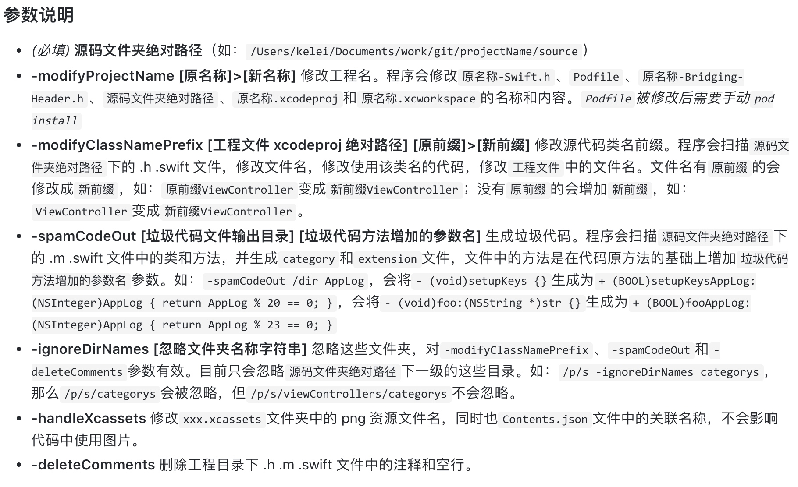

示例：
```
# 1. 项目名地址，注意不是项目文件夹地址
/Users/vincent/Desktop/code/spamCode/VHLSpamCodeDemo/VHLSpamCodeDemo   
# 2. 修改项目名称
-modifyProjectName VHLSpamCodeDemo>VHLSpamCodeDemo1
# 3. 忽略文件夹
-ignoreDirNames Depends
# 4. 修改类名前缀。没有前缀的会加上前缀，有前缀的会修改。注意修改后是否重名
-modifyClassNamePrefix /Users/vincent/Desktop/code/spamCode/VHLSpamCodeDemo/VHLSpamCodeDemo.xcodeproj VHL>VIN
# 5. 生成垃圾代码
-spamCodeOut /Users/vincent/Desktop/code/spamCode/VHLSpamCodeDemo/VHLSpamCodeDemo2/SpamCode VSpam
# 6. 修改 xxx.xcassets 文件夹中的 png 资源文件名
-handleXcassets
# 7. 删除空行和注释 
-deleteComments
```


修改工程名后，如果包含 pod，需要到文件夹下重新执行 `pod update`
    
### 1.5 优化图片大小，修改图片 hash 值

- [ImageOptim](https://imageoptim.com/mac) 

    mac 下无损压缩图片工具，将包含图片的文件夹拖入工具，会自动扫描文件夹下的所有文件，自动选择最优算法进行优化。一般第一次优化项目时，会有几M到10几M的优化效果。
- [ImageMagick](http://www.imagemagick.org/script/index.php)

    ImageMagick: 是一款创建、编辑、合成，转换图像的命令行工具。
    
    通过 `brew` 安装 `imagemagick`
    ```
    brew install imagemagick
    ```
    压缩文件夹下所有 png 文件，会修改 hash 值
    ```
    find . -iname "*.png" -exec echo {} \; -exec convert {} {} \;
    ```
    
    更多 `imagemagick` 命令以及使用方法 
    [图像处理 - ImageMagick 简单介绍与案例](https://aotu.io/notes/2018/06/06/ImageMagick_intro/index.html)
    
## 2. 逆向基础，以及为什么要做混淆

当我们用 Xcode 构建一个程序的过程时，编译器会把源文件 (.m 和 .h) 文件转换为一个可执行文件。这个可执行文件中包含的字节码会将被 CPU 执行，虽然不能直接从这些字节码中查看我们的核心代码，但是黑客可以通过一些反汇编的逆向工具来分析我们的程序，找到漏洞进行破解。

> 可执行文件格式

**EXE**     `Windows` 下可直接执行的文件扩展名
**ELF**     `Linux` 下的可执行文件
**Mach-O**  `MacOS/iOS` 下主要的可执行文件

### 2.1 Mach 与 Mach-O

Mac 是苹果电脑 Macintosh 的简称，而 Mach 则是一种操作系统内核。Mach 内核被 NeXT 公司的NeXTSTEP 操作系统使用。在Mach上，一种可执行的文件格是就是 Mach-O（Mach Object file format）。1996年，乔布斯将 NeXTSTEP 带回苹果，成为了OS X的内核基础。所以虽然 MacOS X 是 Unix 的“后代”，但所主要支持的可执行文件格式是 Mach-O。

### 2.2 iOS 可执行文件

通常我们通过 Xcode 打包或者从应用商店下载的 APP 都是 `ipa` 包（iPhone Application）。这是一个变相的 zip 压缩包，可以通过 `unzip` 命令进行解压。

解压之后，会有一个 Payload 目录，而 Payload 里则是一个 **.app** 文件，而这个实际上又是一个目录，或者说是一个完整的 App Bundle。

在这个目录中，里面体积最大的文件通常就是和 ipa 包同名的一个二进制文件。通过 `file` 命令可以查看该文件的类型

```
xx: Mach-O universal binary with 2 architectures: [arm_v7:Mach-O executable arm_v7] [arm64]
xx (for architecture armv7):	Mach-O executable arm_v7
xx (for architecture arm64):	Mach-O 64-bit executable arm64
```
这里可以看出，这是一个支持 armv7 和 armv7s 两种处理器架构的通用程序包，里面包含的两部分都是 Mach-O 格式。

> 
**i386** 模拟器32位处理器
**x86_64** 模拟器64位处理器
**armv7,armv7s** 真机32位处理器
**arm64** 真机64位处理器

Mach-O 的文件结构：


从这张图上来看，Mach-O文件的数据主体可分为三大部分，分别是头部（Header）、加载命令（Load commands）、和最终的数据（Data）。

### 2.3 class-dump

[class-dump](http://stevenygard.com/projects/class-dump/) 是一个利用 Objective-C 语言的 runtime 特性，将存储在 Mach-O 文件结构里 data 部分的类属性和方法等信息提取出来，并生成对应的 .h 文件的工具。**注意: 必须是脱壳后的可执行文件。(比如通过越狱手机或者第三方应用下载渠道)**

#### 2.4 安装使用

在 [class-dump](http://stevenygard.com/projects/class-dump/) 官网下载 dmg，将 dmg 里面的 `class-dump` 拷贝到 `/usr/local/bin` 文件夹下，然后就可以在终端中使用 `class-dump` 命令了。

简单使用：
```
class-dump -H [需要被导出的 Mach-O 文件路径] -o [头文件输出目录地址]
```

也可以可以查看导出后的头文件目录：

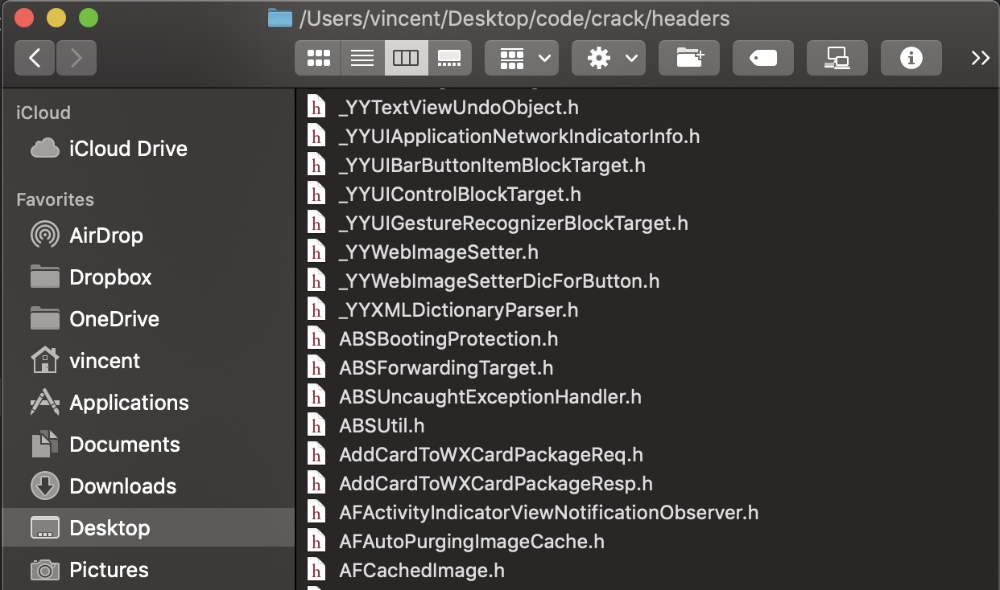

### 2.5 hopper 

[Hopper](https://www.hopperapp.com/) 是一种适用于 OS X 和 Linux 的逆向工程工具，可以用于反汇编、反编译和调试 32位/64位英特尔处理器的 Mac、Linux、Windows 和 iOS 可执行程序。

将 Mach-O 文件拖入 [hopper](https://www.hopperapp.com) 可以查看。

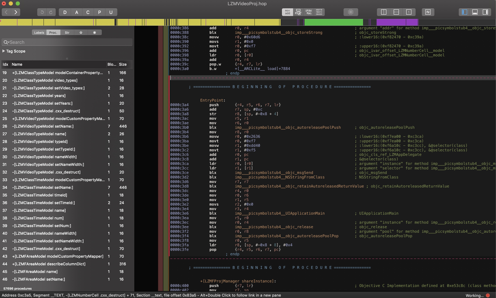


通过以上的方式，别人可以对照应用的功能来分析代码逻辑，从而进行针对性的破解。所以对项目的核心的代码进行混淆就是非常有必要的了。

## 3. 代码混淆

常规的混淆思路：

- 花代码花指令，即随意往程序中加入迷惑人的代码指令
- 易读字符替换

防止被 class-dump 后，被人分析核心代码逻辑。可以对关键，已读的字符串进行替换，比如 `ad`, `vip` 等关键词。

### 3.1 替换字符串混淆

但是我们又不想替换成不想关的字符串后给自己调试带来麻烦，这里我们可以使用 [HSKConfuse](https://github.com/housenkui/HSKConfuse) 的 shell 脚本，通过在Build Phrase 中设定在编译之前进行方法名的字符串替换，从而在不影响自己编写代码的基础上，对编译后的二进制包进行混淆。

首先在项目中新建文件：
```
confuse.sh： 存放混淆的脚本
func.list： 需要混淆的方法、变量名
```

**confuse.sh**
```
#!/usr/bin/env bash

TABLENAME=symbols
SYMBOL_DB_FILE="symbols"
STRING_SYMBOL_FILE="$PROJECT_DIR/VHLObfuscationDemo/VHLObfuscation/func.list"

CONFUSE_FILE="$PROJECT_DIR/VHLObfuscationDemo"
HEAD_FILE="$PROJECT_DIR/VHLObfuscationDemo/VHLObfuscation/codeObfuscation.h"

export LC_CTYPE=C

# ** 可以不执行下面的方法，替换成自己的规则手动写入到 func.list 中**
# 取以.m或.h结尾的文件以+号或-号开头的行，并以 vhl_ 开头的方法 |去掉所有+号或－号|用空格代替符号|n个空格跟着<号 替换成 <号|开头不能是IBAction|用空格split字串取第二部分|排序|去重复|删除空行|删掉以init开头的行>写进func.list
grep -h -r -I  "^[-+]" $CONFUSE_FILE  --include '*.[mh]' |sed "s/[+-]//g"|sed "s/[();,: *\^\/\{]/ /g"|sed "s/[ ]*</</"| sed "/^[ ]*IBAction/d"|awk '{split($0,b," "); print b[2]; }'| sort|uniq |sed "/^$/d"|sed -n "/^vhl_/p" >$STRING_SYMBOL_FILE

#维护数据库方便日后作排重,以下代码来自念茜的微博
createTable()
{
echo "create table $TABLENAME(src text, des text);" | sqlite3 $SYMBOL_DB_FILE
}

insertValue()
{
echo "insert into $TABLENAME values('$1' ,'$2');" | sqlite3 $SYMBOL_DB_FILE
}

query()
{
echo "select * from $TABLENAME where src='$1';" | sqlite3 $SYMBOL_DB_FILE
}

ramdomString()
{
openssl rand -base64 64 | tr -cd 'a-zA-Z' |head -c 16

}

rm -f $SYMBOL_DB_FILE
rm -f $HEAD_FILE
createTable

touch $HEAD_FILE
echo '#ifndef Demo_codeObfuscation_h
#define Demo_codeObfuscation_h' >> $HEAD_FILE
echo "//confuse string at `date`" >> $HEAD_FILE
cat "$STRING_SYMBOL_FILE" | while read -ra line; do
if [[ ! -z "$line" ]]; then
ramdom=`ramdomString`
echo $line $ramdom
insertValue $line $ramdom
echo "#define $line $ramdom" >> $HEAD_FILE
fi
done
echo "#endif" >> $HEAD_FILE

sqlite3 $SYMBOL_DB_FILE .dump

```

以上的 shell 脚本运行后会自动获取 `.h`, `m` 文件中以 `vhl_` 开头的方法写到到该文件。如果需要自定义的话，可以不执行以上那句命令，然后换成自己的规则写入 **func.list** 中。例如：
```
vhl_isVIP
xx_showAD
yy_isAllow
```

然后在 `Build Phases` 中，左上角加号添加 `run script` 填入地址


### 3.2 查看编译结果

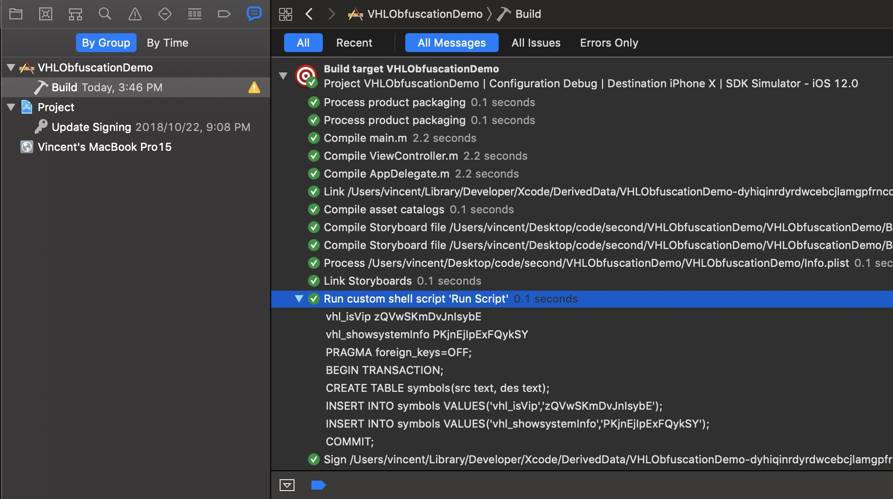
成功编译后，会在指定目录下生成一个 `codeObfuscation.h` 文件。这里可以看到，在编译过程中会执行 shell 脚本，对相关字符串进行替换

添加 `.pch` 文件，并在 `Build Setttings` > `Prefix Header` 中链接该 `.pch` 文件，在 `.pch` 文件中导入 `codeObfuscation.h`，此时项目中指定的方法都被替换成了`codeObfuscation.h` 中的宏定义。

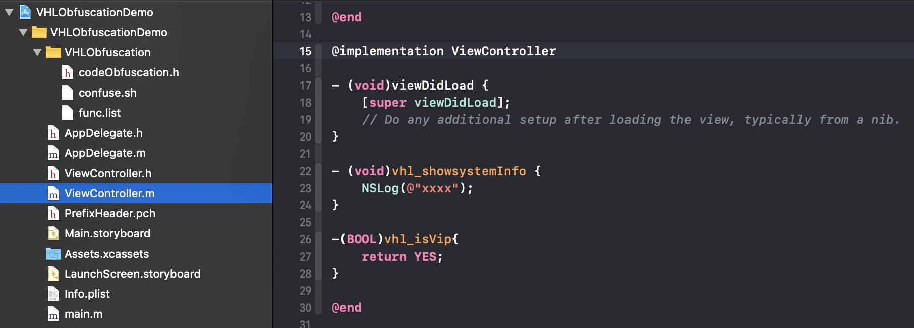


运行成功后将 Products 中的二进制文件拖入到 hopper 中查看

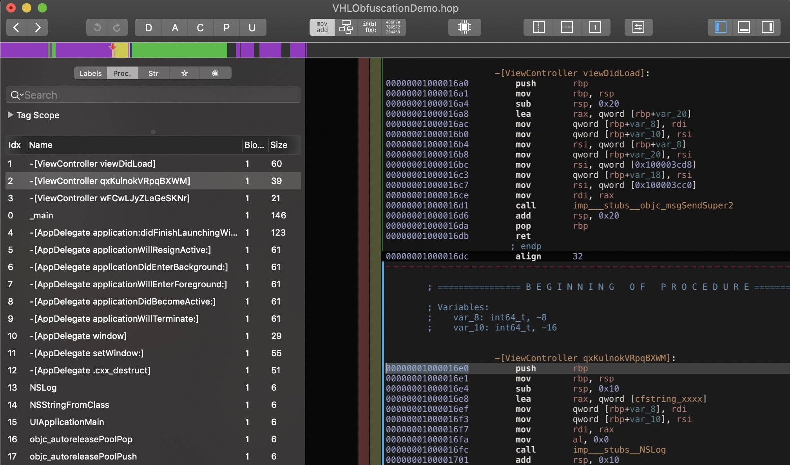

此时，方法已经被混淆了。

**注意：这个不要大面积的使用，会有被审核拒绝的风险，拒绝原因是说你程序里面可能包含有隐藏功能，因为 apple 无法从这些混淆后的方法获取到有用的信息。**

## 4. 编译混淆

以上我们虽然对关键字符串进行了混淆，但是实际代码的执行逻辑等并没有改变。黑客仍然可以通过分析代码逻辑或者伪代码来寻找程序的漏洞。那有没有可能改变编译后的代码逻辑，从而让别人无法分析我们的程序呢。

### 4.1 iOS 是如何编译的
Objective C采用 **Clang** 作为前端，而 Swift 则采用 **swift()** 作为前端，二者都是用 **LLVM(Low level vritual machine)** 作为编译器后端。

编译命令地址
```
# Objective-C
/Applications/Xcode.app/Contents/Developer/Toolchains/XcodeDefault.xctoolchain/usr/bin/clang
# Swift
/Applications/Xcode.app/Contents/Developer/Toolchains/XcodeDefault.xctoolchain/usr/bin/swift
```

Xcode 编译过程：

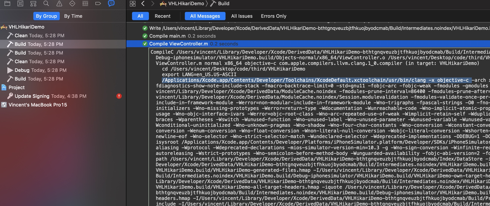

### 4.2 编译器

#### 4.2.1 相关名词
> GCC

（GNU Compiler Collection）缩写，一个编程语言编译器，是GNU（自由软件理事会）的关键部分。也是GNU工具链的一部分。GCC常被认为是跨平台编译器的事实标准，特别是它的C语言编译器。GCC原本只能处理C语言。但是面对Clang的竞争，很快作出了扩展，现在已经可以处理C++，Fortran、Pascal、Object-C、Java、Ada，以及Go语言。许多操作系统，包括许多Unix系统，如Linux及BSD家族都采用GCC作为标准编译器。MacOSX也是采用这个编译器。

> LLVM

是Low Level Virtual Machine的简称。这个库提供了与编译器相关的支持，能够进行程序语言的编译期优化、链接优化、在线编译优化、代码生成。可以作为多种语言编译器的后台来使用。

> Clang

Clang 是 LLVM 的子项目，是 C，C++ 和 Objective-C 编译器，目的是提供惊人的快速编译，比 GCC 快3倍，其中的 clang static analyzer 主要是进行语法分析，语义分析和生成中间代码，当然这个过程会对代码进行检查，出错的和需要警告的会标注出来。

> 前端编译器

编译器前端的任务是进行：语法分析，语义分析，生成中间代码(intermediate representation )。在这个过程中，会进行类型检查，如果发现错误或者警告会标注出来在哪一行。
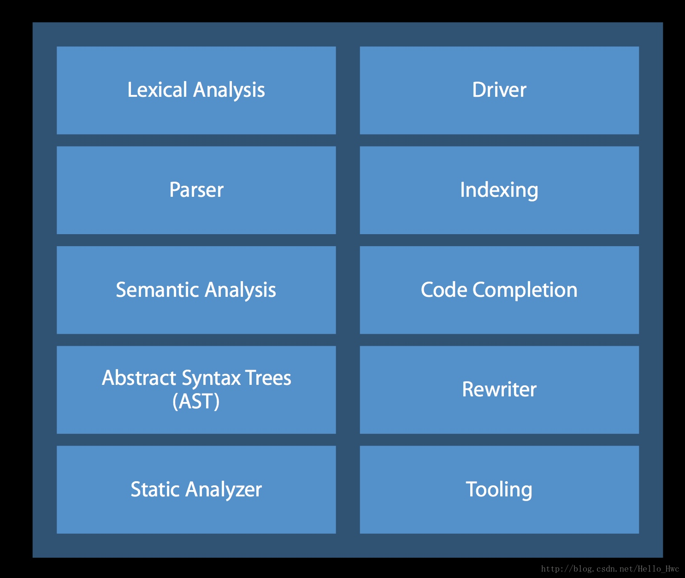

> 后端编译器

编译器后端会进行机器无关的代码优化，生成机器语言，并且进行机器相关的代码优化。iOS的编译过程，后端的处理如下

LVVM 优化器会进行 BitCode 的生成，链接期优化等等。 

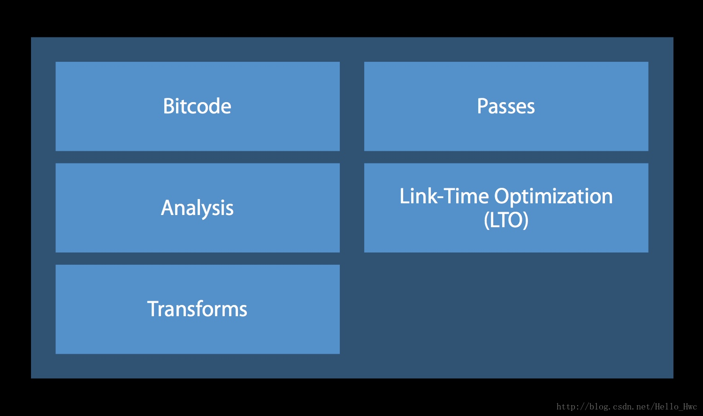

LLVM机器码生成器会针对不同的架构，比如arm64等生成不同的机器码。

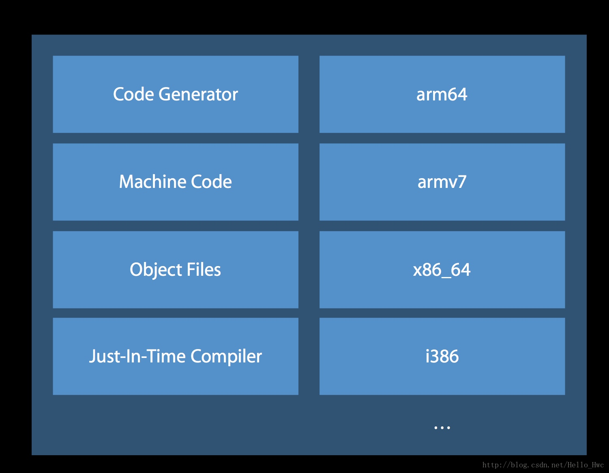

2000年，伊利诺伊大学厄巴纳－香槟分校（University of Illinois at Urbana-Champaign 简称UIUC）这所享有世界声望的一流公立研究型大学的 **Chris Lattner**（他的 twitter [@clattner_llvm](https://twitter.com/clattner_llvm) ） 开发了一个叫作 Low Level Virtual Machine 的编译器开发工具套件，后来涉及范围越来越大，可以用于常规编译器，JIT编译器，汇编器，调试器，静态分析工具等一系列跟编程语言相关的工作，于是就把简称 LLVM 这个简称作为了正式的名字。Chris Lattner 后来又开发了 Clang，使得 LLVM 直接挑战 GCC 的地位。2012年，LLVM 获得美国计算机学会 ACM 的软件系统大奖，和 UNIX，WWW，TCP/IP，Tex，JAVA 等齐名。

Chris Lattner 生于 1978 年，2005年加入苹果，将苹果使用的 GCC 全面转为 LLVM。2010年开始主导开发 Swift 语言。

iOS 开发中 Objective-C 是 Clang / LLVM 来编译的。

### 4.3 Hikari

[Hikari](https://github.com/HikariObfuscator/Hikari) 是一个基于 [Obfuscator-LLVM](https://github.com/obfuscator-llvm/obfuscator) 对 Xcode9的适配。

OLLVM 是瑞士西北应用科技大学安全实验室于2010年6月份发起的一个项目，该项目旨在提供一套开源的针对 LLVM 的代码混淆工具，以增加对逆向工程的难度。目前，OLLVM已经支持LLVM-4.0版本。

#### 4.3.1 安装

下载 github 提供的 pkg 安装文件并双击安装
```
https://github.com/HikariObfuscator/Hikari/releases
```

然后重启 Xcode 就能看到已经有 Kikari 编译工具

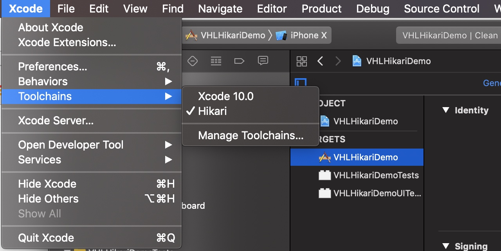


#### 4.3.2 使用

1. `Xcode` -> `Toolchains` -> `Hikari` 将混淆工具和项目关联
2. 将所有与要运行的 target 相关的 target（包括pod进来的库）`Enable Index-While-Building` 的值改为 *NO*。
3. `Optimization Level` 的值设置为 `None[-O0]`
4. 在 `Build Settings` -> `Other C Flags` 中加入混淆标记

```
-mllvm -enable-bcfobf 		启用伪控制流  
-mllvm -enable-cffobf 		启用控制流平坦化
-mllvm -enable-splitobf 		启用基本块分割  
-mllvm -enable-subobf 		启用指令替换  
-mllvm -enable-acdobf 		启用反class-dump  
-mllvm -enable-indibran 		启用基于寄存器的相对跳转，配合其他加固可以彻底破坏IDA/Hopper的伪代码(俗称F5)  
-mllvm -enable-strcry 		启用字符串加密  
-mllvm -enable-funcwra 		启用函数封装
-mllvm -enable-allob	      依次性启用上述所有标记
```


重新编译就会使用 Hikari 在编译器后端对项目进行编译了。

将编译后的二进制文件拖入 hopper 中进行对比

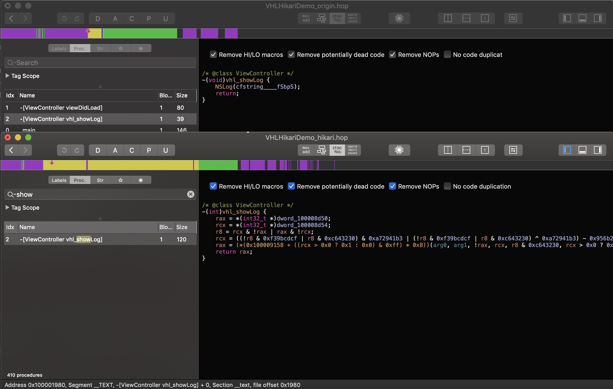

发现代码已经被混淆过了。
**最新的 Xcode10 通过非官方默认的 Toolchains 编译后的的 ipa 是拒绝提交审核的。**

## 总结

以上是对 iOS 下马甲包，代码混淆，编译混淆的一些学习实践，实际使用中需要根据自己的实际需求进行调整尝试。

加密与破解，编译与反编译永远都是在不停攻防的。没有一堵绝对安全的墙，也没有绝对完美的银弹。只有在开发成本与安全成本中找个一个平衡，才是可持续发展的选择。

# 参考文章
- 马甲包

    [马甲包](https://www.jianshu.com/p/339c62db048f)

    [KLGenerateSpamCode](https://github.com/klaus01/KLGenerateSpamCode)
- 逆向基础，为什么要混淆

    [了解iOS上的可执行文件和Mach-O格式](http://www.cocoachina.com/mac/20150122/10988.html)
- 类名/方法混淆

    [iOS安全攻防（二十三）：Objective-C代码混淆](https://blog.csdn.net/yiyaaixuexi/article/details/29201699)

    [iOS代码混淆](https://www.jianshu.com/p/19bf42f22473)
- 编译混淆

    [深入剖析 iOS 编译 Clang LLVM](https://github.com/ming1016/study/wiki/%E6%B7%B1%E5%85%A5%E5%89%96%E6%9E%90-iOS-%E7%BC%96%E8%AF%91-Clang---LLVM)

    [iOS混淆笔记](https://juejin.im/post/5ba05c3c6fb9a05d31550275)

    [基于clang插件的一种iOS包大小瘦身方案](https://mp.weixin.qq.com/s?__biz=MzUxMzcxMzE5Ng==&mid=2247488360&amp;idx=1&amp;sn=94fba30a87d0f9bc0b9ff94d3fed3386&source=41#wechat_redirect)

    [iOS混淆笔记](https://juejin.im/post/5ba05c3c6fb9a05d31550275)

    [Obfuscator-LLVM在iOS中的实践](https://www.jianshu.com/p/a631b5584de6)
    
    [iOS APP的加固保护原理](https://mp.weixin.qq.com/s/gthDSLw45GW3oVlsAOm-dQ?)

- 审核

    [一篇文章讲清如何应对 App Store 审核 2.1 大礼包](https://juejin.im/post/5bbaba595188255c9f06cdfd?utm_source=gold_browser_extension)